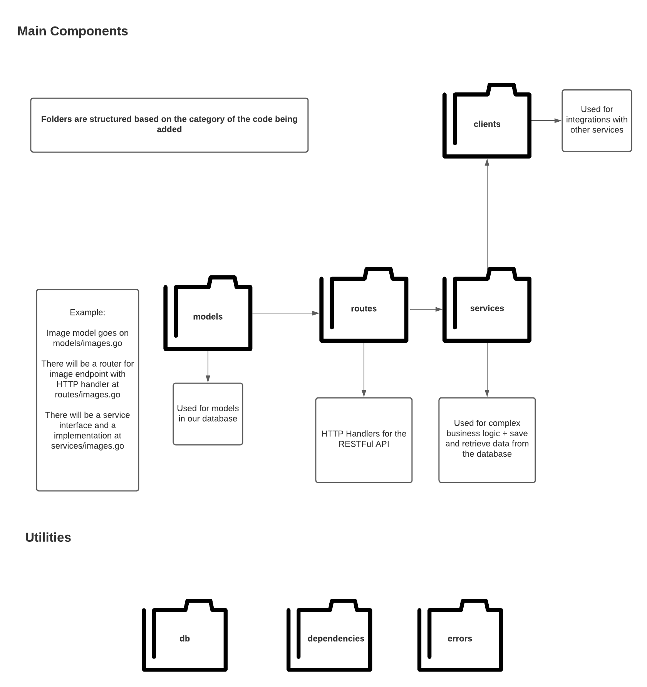

# Contributing

This is a project that welcome contributors from all backgrounds and technical levels and discrimination will not be tolerated.

The following is a deep dive into what is important to know to contribute to the code, and it is important to read and follow the steps on the [README](README.md) file.

## Folder structure

Edge API's code is organized in a couple of top-level important folders:

```
- edge-api/
-- cmd/
-- config/
-- deploy/
-- logger/
-- pkg/
-- scripts/
```

The `cmd` folder contains scripts like the openapi generation script and the database migration script. These scripts can be invoked locally and/or by the containers during build or execution, depending on what they are and when it's important for them to run.

The `config` folder has the code to retrieve configuration values from environment variables and Clowder. Every time you need to add or change anything related to the main configuration of Edge API, you should go there.

The `deploy` folder contains configuration values for the stage and production environment. You'll likely add something there if you create a new variable that needs to have specific default value for an environment or a specific value that is retrieved by deployment parameters.

The `logger` folder contains code related to logging on Edge API. It has the main logger used by Edge API and initializes it with some configuration.

The `pkg` folder contains the actual API code. We'll dive more into this in the above section.

The `scripts` folder has scripts used by Edge API or end users, like the ansible registration playbook used by users to register a new Edge device.


## Code structure

```
- edge-api/
(...)
-- pkg/
--- clients/
--- db/
--- dependencies/
--- errors/
--- models/
--- routes/
--- services/
```



The four main components of this structure are `routes`, `services`, `models` and `clients`.

Ideally, you write your code around a **domain**. The two main domains on Edge API are Images and Devices. Everything happens around them. Important domains are UpdateTransactions, Commits, Installers, ImageSets and (soon) DeviceSets.

The routes of a particular domain are in a file under the `routes` folder. For image API routes, for example, we have `images.go` living under that folder. Routes can also be called handlers as they are the HTTP Handler for a given URL pattern. Each route file exposes one or more routes and created a sub router with those routes. The responsability of a route is to receive an API call, get the data from the API call in a way that is easy to pass forward - either creating a struct, a variable, whatever fits the use case better -, call the correspondent `service` and handle the service response to deal with HTTP status. This is the only layer that is responsible for the HTTP server bits of our code and knows the status codes and request/responses from our API.

The `service` layer is responsible for all the code related to the business logic. If necessary, it interacts with the database and API clients to achieve what is needed. The service layer does not know HTTP status or anything related to the API server, as the main idea is that its code could be easily used if we decide to serve our API through a different interface that is not HTTP (gRPC, for example).

The `models` layer defines the database schema and the API models. They are essentially the domain that guides what goes on the other layers, and useful domain around it.

The `clients` packages are implementation of API calls to internal services. Those APIs do not have go clients, therefore we create a client for it. This is particularly important for us to mock API calls to other services while unit tests our service layer.

Other folders were created in a peer-need basis, always following the idea that we want to avoid a `helpers` or `utils` package, otherwise this will be a package where we'll put everything in and there is a high chance that we aren't designing our software correctly.

## How do we do logging

We need to be very careful on our code and make sure we are adding logs in all of the right levels for all endpoints, across the code. 

Logging must follow the above logging key concepts as much as possible.

### Key concepts

- Messages will only contain plain English and we should be able to group by messages, which means that no variables can be added.
- All useful data must go into extra fields. Try to keep the pattern for the extra field name from the rest of the code for common things ("error" for errors, "imageID" for image ID, or for other objects use "objectID").
- The dependencies middleware adds request-id and account number for debugging & distributed tracing. This is important and needs to be used accross all log messages.
- The HTTP Handler has an instance of log that can be accessed through services.Log.
- The services used by the HTTP Handler should be initialized by the dependencies middleware, and they should accept an instance of a LogEntry on the constructor. This needs to be per-request, and relies heavily on context, to be able to have one instance of logging per dependency. This can be refactored in the future if we realize it's not the best way (it's probably not) as long as we keep the functionality.
- Each service will gain a log entry as a private variable and this LogEntry should be used to log inside of the service (s.log instead of log).
- All IDs must be added to the LogEntry when an object is saved.
- All errors must be logged by the first method that catches them.
- Be mindful of log levels. **Debug** is for insights of a route. **Info** should give enough information on a production service to answer most questions about what happened to a specific route for a specific customer. **Error** is for actual errors.

Happy logging!

## Guidelines for submitting a Pull Request

In order to successfully submit a PR we recommend the following guidelines:

- Create your PR against main.
- Keep your PR small, less than 200 lines of code.
- Any new PR must have unit tests. Unit tests do not count towards the total number of lines of code. Total code coverage must increase with each PR.
- Squash your commits. Each PR should contain only one commit
- Ensure your commit message is clear, easy to read, and is very informative. We recommend using words like "Added", "Removed", "Refactored", "Deleted" and "Fixes" to outline the changes made.
- Never merge your own PR.
- We work off of a +2 system, where every reviewer can give a +1 if they are happy with the changes. 2 reviewers are required to merge a PR, but if you feel your PR is particularly complicated, you can request more reviewers.
- Ensure you have run "make pre-commit" before submitting the PR.
- Ensure your PR compiles and runs before submitting.
- Add a detailed description about the changes this PR will make to the code base, e.g. "Added new filtering to `/images/view` endpoint".
- If applicable, include any references to external tools in the PR name. e.g. "Addresses|Resolves|Fixes JIRA-1234". or "Fixes Bugzilla-1234"
- Technical Debt: When dropping a // FIXME: or // TODO: in your code, consider going ahead and making that change, even if it means crossing into the next Sprint.
- Keep the code reviews respectful, this is a project that welcomes contributors from all backgrounds and technical levels. Discrimination will not be tolerated.
